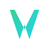

  

WesCode Full-Stack Starter

A starting point for building modern, full-stack web applications with Next.js and the power of serverless.

## Key Technologies

-   [Next.js](https://nextjs.org/): A React framework for building performant web applications.
-   [Netlify](https://www.netlify.com/): A platform for deploying and hosting web applications.

## Getting Started

1.  Clone this repository.
2.  Install dependencies: `npm install`
3.  Run the development server: `npm run dev`
4.  Open [http://localhost:3000](http://localhost:3000) in your browser.

## Features Demonstrated

-   Next.js features (e.g., routing, components, API routes).
-   Serverless functions.
-   Contextual alerts.
-   Dynamic content fetching.

## Contributing

(Optional) If you want to make it open-source, add instructions on how to contribute.
